[TOC]
# 毕业设计管理系统实验报告 
------

### 小组成员
<b>姓名&emsp;&emsp;&emsp;&emsp;&emsp;&emsp;学号</b>
<b>黄亦铠&emsp;&emsp;&emsp;&emsp;&emsp;PB201111653</b>
<b>黄轩阳&emsp;&emsp;&emsp;&emsp;&emsp;PB201111652</b>
<b>刘文杰&emsp;&emsp;&emsp;&emsp;&emsp;PB201111655</b>

------

### 概述
#### 系统目标
本次实验目标为实现一个毕业设计管理系统，使用B/S架构。系统的设计目标如下：
1. 数据库结构兼具简洁与高效性，满足BCNF范式。
2. 使用MySql的存储过程，事务等特性。
3. 添加对文件的处理。
4. 正确实现数据库与浏览器的通信。
5. 数据修改实时反应到数据库上，保证数据库的一致性。
6. 用户和管理员共同的登录界面，分离的操作界面。
7. 保证浏览器可以避免或处理一些可预知的错误，并给予用户提示。
8. 界面简洁美观，操作友好。

#### 需求说明
##### 数据需求
###### 管理员
管理员账户由系统开发时导入，包括管理员编号，管理员姓名。管理员可以创建账户并指定职工号或者学号，所在学院。账户包含账户名密码，创建日期，账户等级（0：管理员，1：教师，2：学生）。
###### 教师
每个教师对应一个职工号以及一个账户；个人信息包含联系方式，所在学院与个人简介；教师可以发布多个课题。每个课题包含课题编号，课题名称，课题简介，发布日期，课题进度，课题成绩；每个课题可以发布两次答辩。答辩包含答辩编号，答辩日期，答辩地址，答辩成绩（由一个子类，答辩小组成绩来得出）。
###### 学生
每个学生对应一个学号以及一个账户；个人信息包含联系方式，所在学院与个人简介；学生只能选择一个课题；可以上传多篇论文。论文包含论文编号，论文名称，论文路径，上传时间，论文成绩。

##### 功能需求
###### 管理员
对所有账户的增、删、改、查。查看系统中所有课题信息。
###### 教师
对个人信息的修改，修改密码，发布课题，修改课题简介，删除课题，课题评分，发布答辩，答辩评分，审阅论文，论文评分，学生查看，学生评分。
###### 学生
对个人信息的修改，修改密码，选择课题，查看对应课题及教师信息，查看课题得分，查看答辩信息，查看答辩得分，上传论文，查看论文得分。

#### 本报告的主要作用
1. 介绍本系统的设计目标及功能需求；
2. 介绍本系统的总体设计思路，系统工作流程，数据库设计；
3. 介绍本系统各个功能模块的设计实现；
4. 演示本系统运行结果；
5. 总结系统设计过程中的问题及解决方案；
6. 总结本系统开发过程中的体会及感悟。

### 实验环境 
1. PC 一台
2. node v18.16.0
3. mysql Ver 8.0.32 

### 总体设计 
#### 数据库设计 

    

    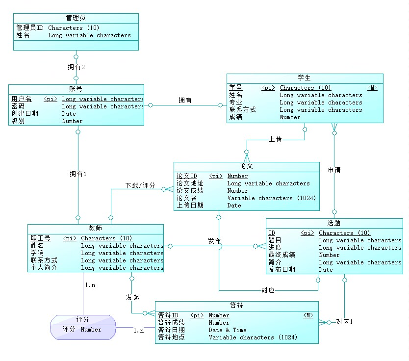
     
    ER图
    

#### 界面设计 
##### 登录界面
<!--  -->

##### 管理员界面
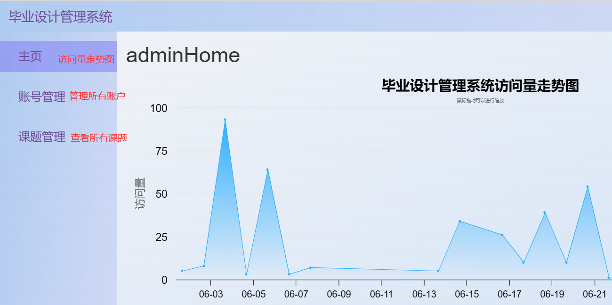
##### 教师界面
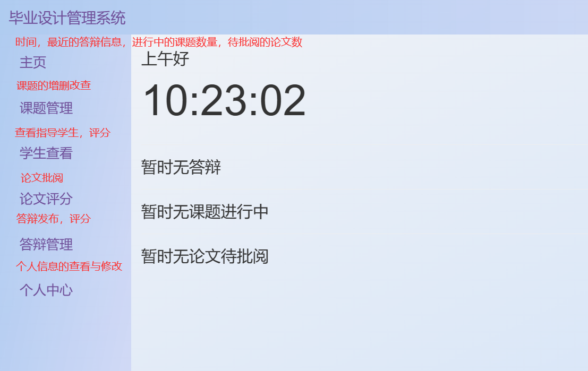
##### 学生界面

#### 操作设计 
##### 管理员
###### 账号管理
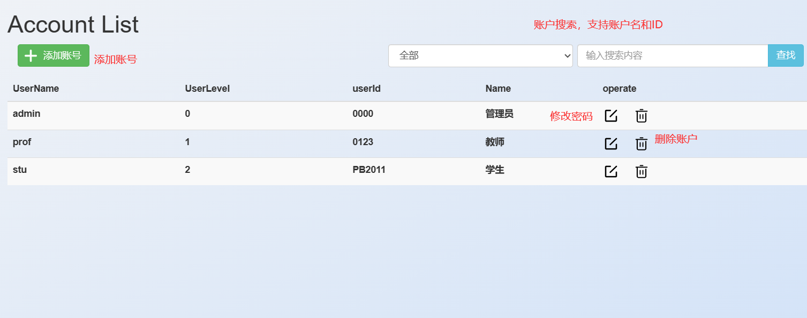
###### 课题管理
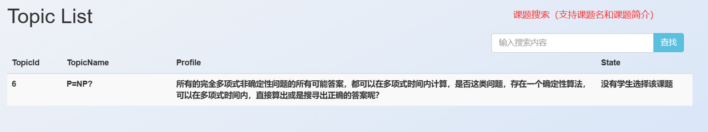
##### 教师
###### 课题管理
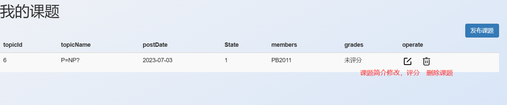
###### 学生查看
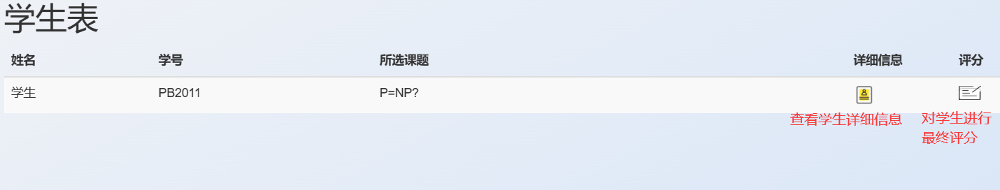
###### 论文评分
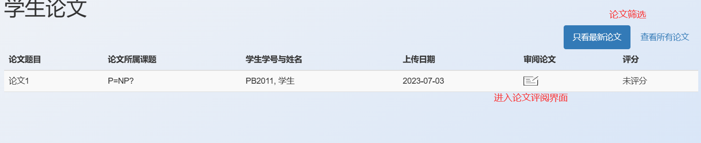
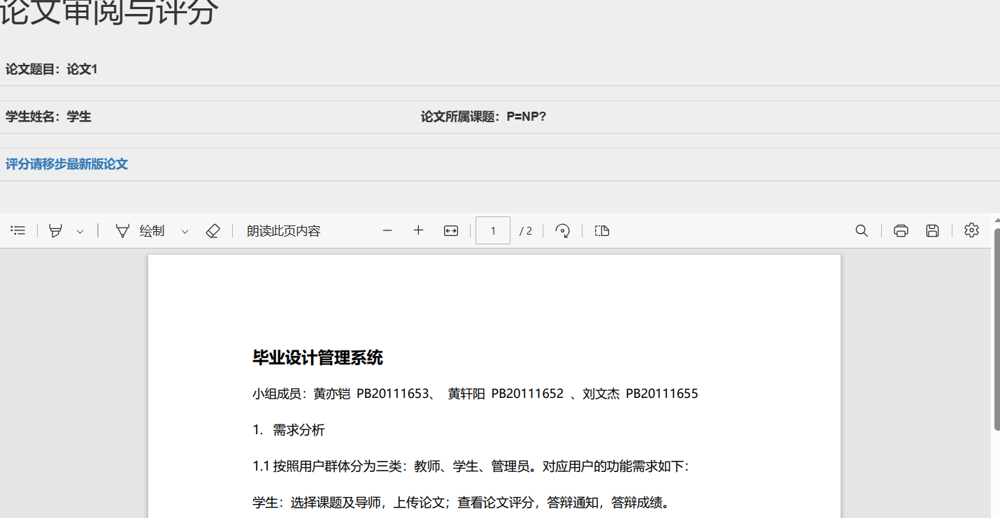
###### 答辩管理
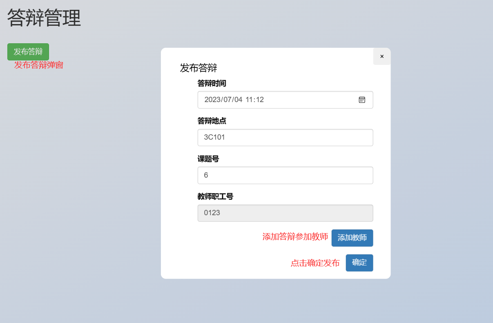
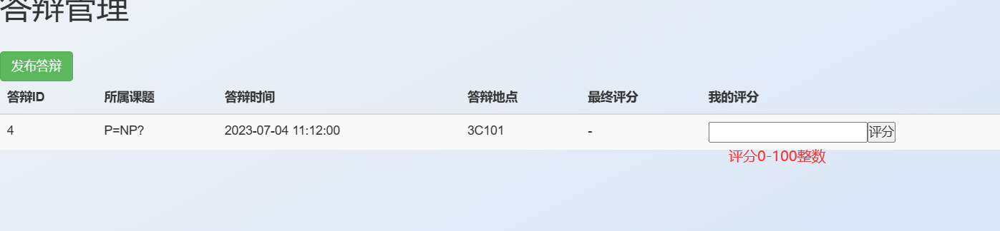
###### 个人中心
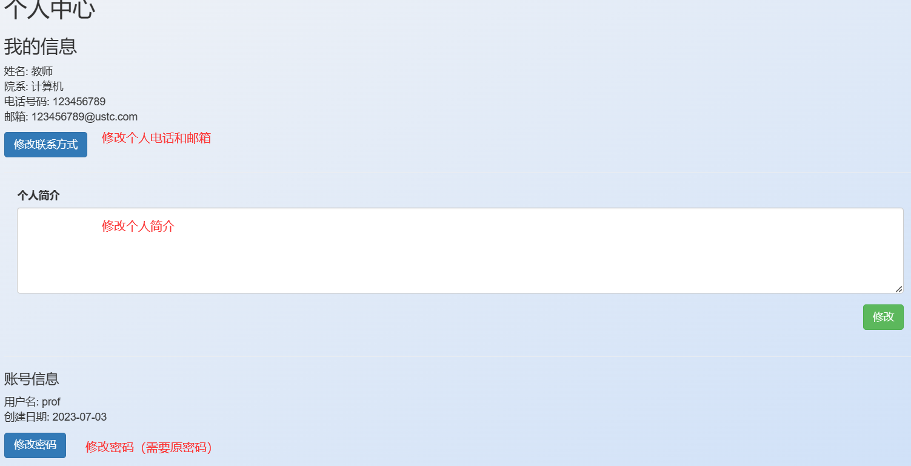
##### 学生
###### 我的课题

###### 课题选择
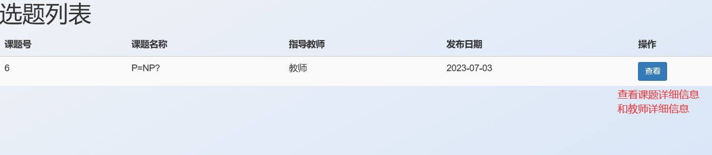
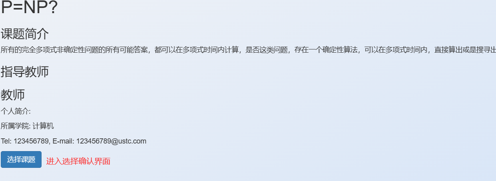
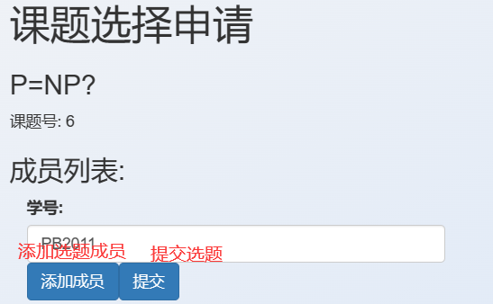
###### 文档管理
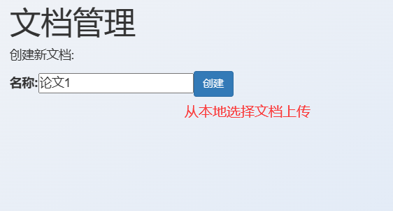

###### 答辩信息

###### 个人中心

###  实现与分工
#### 数据库设计
TODO:

#### 界面与操作设计
##### 登录界面
1. 开源登录界面，具有点击输入框放大效果，添加了登录失败弹窗的效果，使用bootstrap的alert实现；**(黄轩阳)**

##### 管理员界面
1. 访问量走势图使用highchart在线库，数据存储在本地的visit.json；**(黄轩阳)**
2. 账户查看使用SELECT语句并传给前端；账户的增加以及密码修改使用弹窗（js控制显示与否），使用POST方法传给后端，用INSERT和UPDATE语句更新数据库；账户的删除有确认弹窗，使用delete方法传给后端，用DELETE语句从数据库删除；账户的模糊查找使用LIKE语句；**(黄轩阳)**
3. 课题的查看使用SELECT语句并传给前端；课题的模糊查找使用LIKE语句；**(黄轩阳)**
4. 使用bootstrap布局以及font-awesome图标库；
5. 每次操作会进行身份检测。

##### 教师界面
1. 主页答辩的提醒，课题与论文的统计，使用SELECT语句并传给前端；**(黄轩阳)**
2. 课题的查看使用SELECT语句并传给前端；课题简介修改与课题发布使用弹窗，使用POST方法（不同路由）传给后端，用INSERT和UPDATE语句更新数据库；课题的删除使用delete方法传给后端，用DELETE语句从数据库删除；**(黄轩阳)**
3. 个人中心的信息显示，使用SELECT语句并传给前端；简介修改，联系方式修改，密码修改，使用POST方法（不同路由）传给后端，需要比对原密码（SELECT语句获取原密码），若原密码错误有失败弹窗，若正确则使用UPDATE语句更新数据库；**(黄轩阳)**
4. 使用bootstrap布局以及font-awesome图标库。
5. 每次操作会进行身份检测。
TODO:

##### 学生界面
TODO:

#### 实现中的难点问题及解决 
1. 有时候使用POST方法，需要表单以外的数据传回后端或者其他情况，form表单的默认POST方法无法满足要求。解决：使用fetch API提交表单数据，手动创建一个POST请求，定义里面的内容，并且能对传回的回答或错误信号作出自定义的反应。**(黄轩阳)**
2. 教师主页需要多个查询的内容，然而query是自动并行的，所以很可能拿不到想要的数据。解决：使用async.parallel处理所有异步查询，在回调函数中统一处理查询结果，这样能获得所有查询结果。**(黄轩阳)**
TODO:

#### 报告撰写
##### 初稿
1. 黄轩阳：实现与分工中自己的部分以及其余全部初稿；
2. 黄亦铠：实现与分工中自己的部分；
3. 黄亦铠：实现与分工中自己的部分。
##### 修改情况
TODO:

### 总结与讨论 
&emsp;&emsp;本次实验使用B/S架构，基于NODE EXPRESS框架实现了一个毕业设计管理系统。在这一过程中，充分理解了数据库设计的优劣，对实验难度的影响，切实体会到了数据库系统相对于文件系统的优点，也掌握了开发中前后端进行通信的基本方法，初步体验了合作开发的过程。
&emsp;&emsp;在实验过程中，也进一步掌握 JavaScript，MYSQL，html，css等语言和工具的使用，对未来的课程学习和工作受益匪浅。