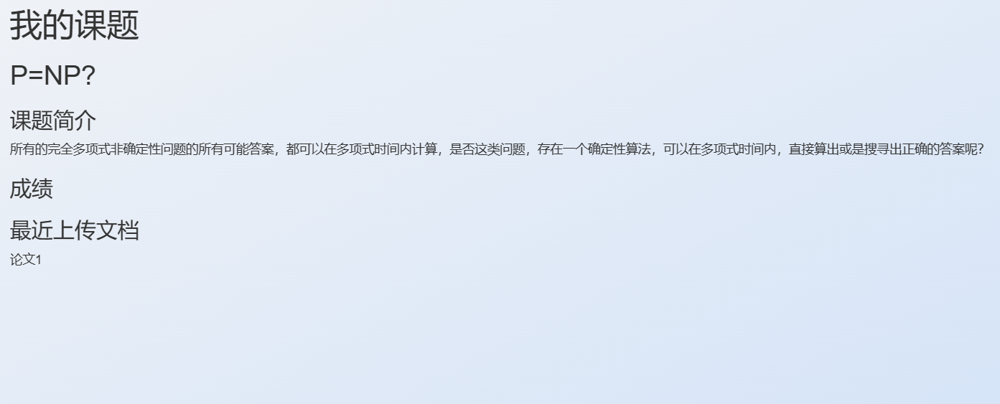

[TOC]
# 毕业设计管理系统实验报告 
------

### 小组成员
<b>姓名&emsp;&emsp;&emsp;&emsp;&emsp;&emsp;学号</b>
<b>黄亦铠&emsp;&emsp;&emsp;&emsp;&emsp;PB201111653</b>
<b>黄轩阳&emsp;&emsp;&emsp;&emsp;&emsp;PB201111652</b>
<b>刘文杰&emsp;&emsp;&emsp;&emsp;&emsp;PB201111655</b>

------

### 概述
#### 系统目标
本次实验目标为实现一个毕业设计管理系统，使用B/S架构。系统的设计目标如下：
1. 数据库结构兼具简洁与高效性，满足BCNF范式(证明见实现部分)。
2. 使用MySql的存储过程，事务等特性。
3. 添加对文件的处理。
4. 正确实现数据库与浏览器的通信。
5. 数据修改实时反应到数据库上，保证数据库的一致性。
6. 用户和管理员共同的登录界面，分离的操作界面。
7. 保证浏览器可以避免或处理一些可预知的错误，并给予用户提示。
8. 界面简洁美观，操作友好。

#### 需求说明
##### 数据需求
###### 管理员
管理员账户由系统开发时导入，包括管理员编号，管理员姓名。管理员可以创建账户并指定职工号或者学号，所在学院。账户包含账户名密码，创建日期，账户等级（0：管理员，1：教师，2：学生）。
###### 教师
每个教师对应一个职工号以及一个账户；个人信息包含联系方式，所在学院与个人简介；教师可以发布多个课题。每个课题包含课题编号，课题名称，课题简介，发布日期，课题进度，课题成绩；每个课题可以发布两次答辩。答辩包含答辩编号，答辩日期，答辩地址，答辩成绩（由一个子类，答辩小组成绩来得出）。
###### 学生
每个学生对应一个学号以及一个账户；个人信息包含联系方式，所在学院与个人简介；学生只能选择一个课题；可以上传多篇论文。论文包含论文编号，论文名称，论文路径，上传时间，论文成绩。

##### 功能需求
###### 管理员
对所有账户的增、删、改、查。查看系统中所有课题信息。
###### 教师
对个人信息的修改，修改密码，发布课题，修改课题简介，删除课题，课题评分，发布答辩，答辩评分，审阅论文，论文评分，学生查看，学生评分。
###### 学生
对个人信息的修改，修改密码，选择课题，查看对应课题及教师信息，查看课题得分，查看答辩信息，查看答辩得分，上传论文，查看论文得分。

#### 本报告的主要作用
1. 介绍本系统的设计目标及功能需求；
2. 介绍本系统的总体设计思路，系统工作流程，数据库设计；
3. 介绍本系统各个功能模块的设计实现；
4. 演示本系统运行结果；
5. 总结系统设计过程中的问题及解决方案；
6. 总结本系统开发过程中的体会及感悟。

### 实验环境 
1. PC 一台
2. node v18.16.0
3. mysql Ver 8.0.32 

### 总体设计 
#### 数据库设计 

    

    
     
    ER图
    

#### 界面设计 
##### 登录界面
<!--  -->

##### 管理员界面

##### 教师界面

##### 学生界面

#### 操作设计 
##### 管理员
###### 账号管理

###### 课题管理

##### 教师
###### 课题管理

###### 学生查看

###### 论文评分

###### 答辩管理

###### 个人中心

##### 学生
###### 我的课题

###### 课题选择

###### 文档管理

###### 答辩信息

###### 个人中心

###  实现与分工
#### 数据库设计
1. 需求分析：讨论了毕业设计管理系统面向的用户群体（管理员、教师、学生）以及对应用户的功能需求。**(黄亦铠、黄轩阳、刘文杰)**
2. 概念模型设计：根据需求分析的结果设计数据库的概念模型，设计ER模型，确定模型中的实体、实体的属性以及实体间的联系。**(黄亦铠、黄轩阳、刘文杰)**
3. 数据库逻辑设计：根据概念模型设计出MySQL的数据库逻辑结构。将ER模型中实体转换为基本表：`Account`,`Administrator`,`Defense`,`Paper`,`Professor`,`Student`,`Topic`，将实体间的联系转换为基本表中的外键关系或新的基本表(`DefGradeGroup`)。**(黄亦铠)**
* **数据库关系模型满足BCNF：对于数据库中的每个关系模式有且仅有一个候选码(如`Defense`候选码为`{defId}`)，且每个关系模式中的其他属性都函数依赖于该候选码且仅依赖于该候选码(如`Defnese`中函数依赖有`{defId->defDate,defId->defAddress,defId->finalGrades,defId->topicId}`)。因此我们设计的数据库关系模式满足BCNF。**
4. 数据库表的触发器/存储过程设计：如`upTopicState`：`Student`表的触发器，用于在学生选题后修改对应课题的状态。`upDefGrades`：`defGradeGroup`表的触发器，用于在教师给对应答辩打分后，更新答辩的总分(即所有教师的平均分)。**(黄亦铠)**

#### 界面与操作设计
##### 登录界面
1. 开源登录界面，具有点击输入框放大效果，添加了登录失败弹窗的效果，使用`bootstrap`的`alert`实现；**(黄轩阳)**

##### 管理员界面
1. 访问量走势图使用`highchart`在线库，数据存储在本地的`visit.json`；**(黄轩阳)**
2. 账户查看使用`SELECT`语句并传给前端；账户的增加以及密码修改使用弹窗（js控制显示与否），使用`POST`方法传给后端，用`INSERT`和`UPDATE`语句更新数据库；账户的删除有确认弹窗，使用`delete`方法传给后端，用`DELETE`语句从数据库删除；账户的模糊查找使用`LIKE`语句；**(黄轩阳)**
3. 课题的查看使用`SELECT`语句并传给前端；课题的模糊查找使用`LIKE`语句；**(黄轩阳)**
4. 使用`bootstrap`布局以及`font-awesome`图标库；
5. 每次操作会进行身份检测。

##### 教师界面
1. 主页答辩的提醒，课题与论文的统计，使用`SELECT`语句并传给前端；**(黄轩阳)**
2. 课题的查看使用`SELECT`语句并传给前端；课题简介修改与课题发布使用弹窗，使用`POST`方法（不同路由）传给后端，用`INSERT`和`UPDATE`语句更新数据库；课题的删除使用delete方法传给后端，用`DELETE`语句从数据库删除；**(黄轩阳)**
3. 个人中心的信息显示，使用`SELECT`语句并传给前端；简介修改，联系方式修改，密码修改，使用`POST`方法（不同路由）传给后端，需要比对原密码（`SELECT`语句获取原密码），若原密码错误有失败弹窗，若正确则使用UPDATE语句更新数据库；**(黄轩阳)**
4. 学生管理页面：使用`SELECT`语句查询选择了当前用户(教师)发布的课题的所有学生以及学生所选课题的信息。基本信息显示在列表中，可以通过点击列表右侧按钮弹出弹窗查看学生的具体个人信息，点击评分按钮为学生选题打分。**(刘文杰)**
5. 综合评分页面：使用`SELECT`语句查询该学生基本信息、学生课题评分、学生论文评分、学生答辩评分并将其显示在表格中，当论文/答辩/课题评分完毕后可以填入综合成绩，使用post方法上传评分。**(刘文杰)**
6. 论文列表页面：教师可查看学生上传的论文(使用SELECT语句查询教师管理的所有学生的论文)，将其显示在列表中；教师可以对学生最新上传的论文进行评阅。**(刘文杰)**
7. 论文评阅页面：根据论文ID使用`SELECT`语句查询对应论文的地址，将对应论文加载到浏览器中进行显示(使用浏览器中显示PDF的工具进行显示)，同时显示论文的其他信息；如果当前论文为最新版，则可进行评分操作。**(刘文杰)**
8. 答辩管理页面：查询该教师发布的所有答辩，将查询到的信息显示在列表中，教师可以通过列表右侧的评分通道进行评分。教师可以在该页面发布新的答辩(通过点击发布答辩的按钮弹出的弹窗进行发布，需要填入合适的课题ID、答辩时间、答辩地点，可以邀请其他参与此次答辩的教师)。**(黄亦铠、刘文杰)**
9. 使用`bootstrap`布局以及`font-awesome`图标库。
10. 每次操作会进行身份检测。

##### 学生界面
1. 学生首页：查询学生选题、论文、答辩信息，显示学生所选课题、最近上传文档以及距离答辩的剩余天数；实现前端的时间显示与根据时间不同的不同问候语。**(黄亦铠)**
2. 学生课题页面：查询学生选题的详细信息，该课题上传的最新文档(可能是课题小组其他成员上传的)，将其显示在页面上。**(黄亦铠)**
3. 学生选题页面：查询课题(未被选择)的信息，显示在列表中，点击查看可以看到课题的详细信息(简介)，若学生未选择课题，可通过选题按钮选择该课题，需要输入学生信息，可以添加小组成员(其他学生)。**(黄亦铠)**
4. 文档管理页面：查询该学生上传的所有文档，显示在列表中；可以创建新的文档，点击修改可查看上传的文档(使用浏览器中显示PDF的工具进行显示)，可以修改文档后上传新版本的文档。**(黄亦铠)**
* **通过在数据库中记录文档路径，并将文档保存在服务器对应路径中。通过`multer`中间件实现文件的上传。**
5. 答辩信息页面：查询并显示该学生的答辩信息，如果未进行显示距离天数，已完成则显示成绩。**(黄亦铠)**
6. 个人中心页面：查询学生个人信息并显示，点击按钮修改联系方式与密码(通过弹窗修改)，修改密码需要输入原密码进行检查。**(黄亦铠)**
7. 使用`bootstrap`布局以及`font-awesome`图标库。
8.  每次操作会进行身份检测。

#### 其他
* 数据库基本表属性的修改，系统鲁棒性检查/debug。**(刘文杰)**
* 实验报告撰写。**(黄轩阳(主要部分)、黄亦铠)**

#### 实现中的难点问题及解决 
1. 有时候使用`POST`方法，需要表单以外的数据传回后端或者其他情况，form表单的默认`POST`方法无法满足要求。解决：使用`fetch` API提交表单数据，手动创建一个`POST`请求，定义里面的内容，并且能对传回的回答或错误信号作出自定义的反应。
2. 教师主页需要多个查询的内容，然而`query`是自动并行的，所以很可能拿不到想要的数据。解决：使用`async.parallel`处理所有异步查询，在回调函数中统一处理查询结果，这样能获得所有查询结果。
3. 学生选题/教师发布答辩都会存在“多人邀请”，即插入/修改数据库中多条语句，可能出现意外情况。解决：使用事务，对于学生选题，使用`async.parallel`并行地修改学生表，判断如果出错或者被修改行数为0(学生不存在的情况)则`rollback`，所有并行函数执行完成后如果无错误则`commit`；对于教师发布答辩，因为`DefGradeGruop`的插入需要`Defense`插入的结果，使用`async.series`串行地进行插入，其他操作类似。

### 总结与讨论 
&emsp;&emsp;本次实验使用B/S架构，基于NODE EXPRESS框架实现了一个毕业设计管理系统。在这一过程中，充分理解了数据库设计的优劣，对实验难度的影响，切实体会到了数据库系统相对于文件系统的优点，也掌握了开发中前后端进行通信的基本方法，初步体验了合作开发的过程。
&emsp;&emsp;在实验过程中，也进一步掌握 JavaScript，MYSQL，html，css等语言和工具的使用，对未来的课程学习和工作受益匪浅。